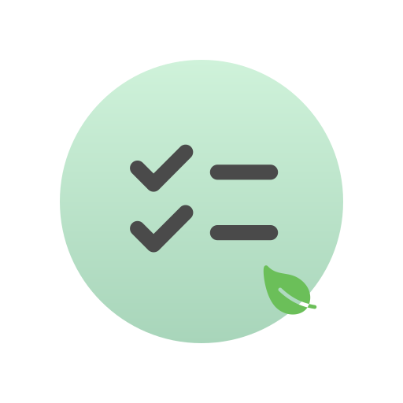

# Todo Render Efficiency

I've started this project, "Todo Render Efficiency," to compare different state management libraries and identify which ones best reduce unnecessary renders in a React todo app.

## Why This Matters

Reducing extra re-renders saves power, making apps more efficient and eco-friendly. Optimized state management benefits user experience and supports sustainable software development across many devices.

## Testing results (ordered by number of stars on GitHub)

We haven’t finished testing all the libraries yet. It’s a work in progress.

- [zustand](https://github.com/pmndrs/zustand)
  - haven't tested
- [jotai](https://github.com/pmndrs/jotai)
  - passed 1/5 tests ❌
  - [run the test yourself](https://github.com/tylerlong/todo-state-management/tree/jotai)
- [valtio](https://github.com/pmndrs/valtio)
  - passed 0/5 tests ❌
  - [run the test yourself](https://github.com/tylerlong/todo-state-management/tree/valtio)
- [manate](https://github.com/tylerlong/manate)
  - passed 5/5 tests ✅
  - [run the test yourself](https://github.com/tylerlong/todo-state-management/tree/manate)

## PRs are Welcome!

We’re building a todo app with each state management library, each on its own branch. If a library has an existing todo app example, we’ll use it as a base, with a few tweaks for our specific tests.

What’s your favorite state management library, and why do you choose it? We’d love for you to create a PR to test its Render Efficiency! If it doesn’t pass every test right away, let’s collaborate to make it even better. Your contributions will help us all find the most efficient and sustainable solutions together.

## Common rules

We disable `<StrictMode>`, because it's for development. We would like to evaluation behaviors for production.

We add a `console.log` to the beginning of EVERY React component, for example `console.log("<ComponentName> render");`. So that we can evaluate the render optimization.

## Testing rules

If a component didn't change, we should **NOT** re-render it, period.

In order to pass a test, the app must **NOT** do any unnecessary renders.

In the mean time, we need to make sure that the app behavior is 100% correct.
If a component changed (its output) and the app didn't re-render it, it is a **critical** bug.

## Preparation

- Create 5 todos with text "todo #1", "todo #2", "todo #3", "todo #4", "todo #5".
- Open browser console
- Clear browser console
- Watch browser console for the tests below

## test 1

Create a new todo with text "todo #6".

It should **NOT** cause the existing 5 todos to re-render because they didn't change.

## test 2

Delete the todo with text "todo #1".

It should **NOT** cause the other 5 todos to re-render because they didn't change.

## test 3

Mark the todo with text "todo #3" as complete.

It should **NOT** cause the other 4 todos to re-render because they didn't change.

Mark the todo with text "todo #4" as complete.

It should **NOT** cause the other 4 todos to re-render because they didn't change.

## test 4

Filter the list to only show complete todos

It should **ONLY** cause the list to re-render.

**None** of the todos should re-render because they didn't change.

Incomplete todos disappeared from screen so we should **NOT** render them.

Complete todos didn't change so we should **NOT** re-render them.

## test 5

Remove the filter to show all todos

It should **ONLY** cause the list and incomplete todos to render.

Complete todos stays in the list without any change, we should **NOT** re-render them.
